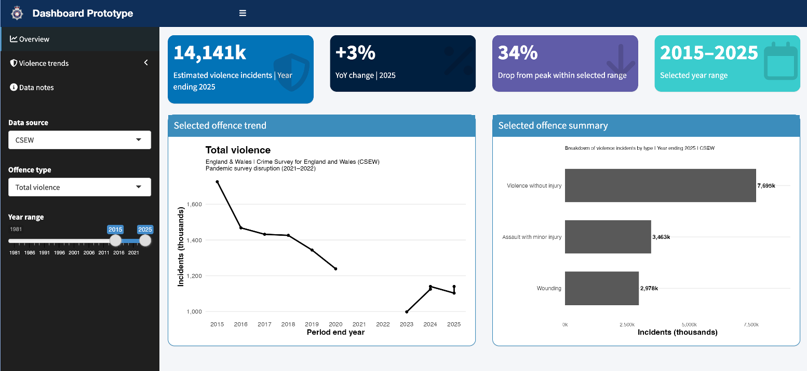
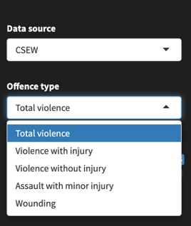
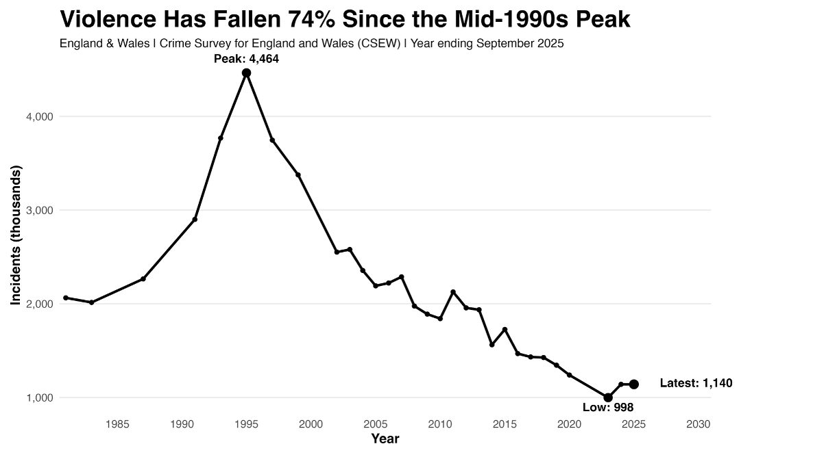
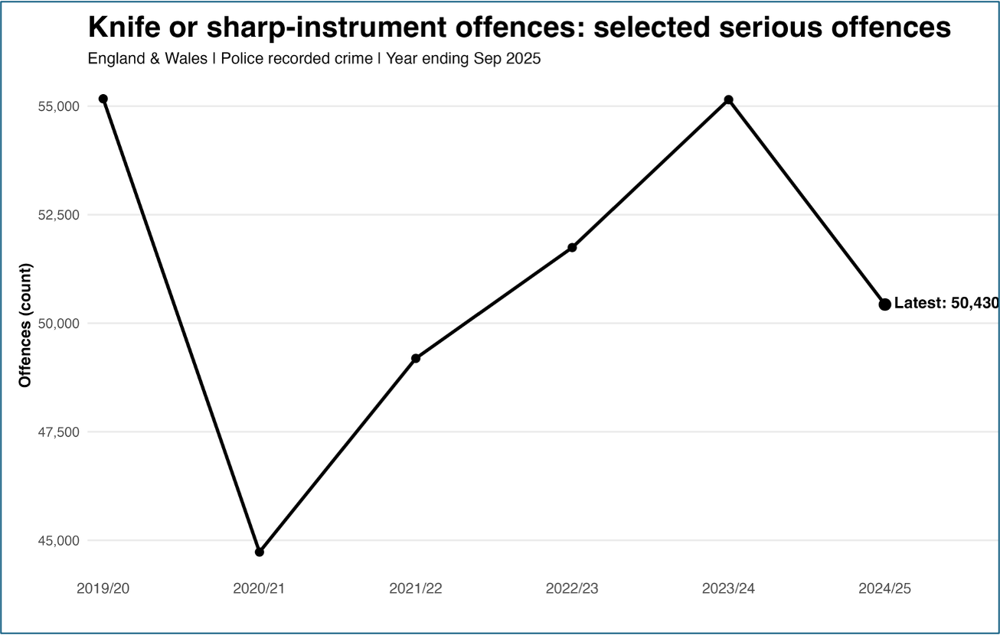

# Crime Analytics Dashboard for Operational Decision-Making

## 📊 Overview
Developed an interactive dashboard using **R Shiny** to analyse violent crime trends in England & Wales using publicly available datasets from the Office for National Statistics (ONS), Crime Survey for England & Wales (CSEW), and Police Recorded Crime.

The dashboard supports operational decision-making by enabling users to explore trends, monitor key indicators, and identify areas of concern through interactive visualisations.

---

## 🔍 Key Insights
- Violent crime has decreased significantly since the mid-1990s peak (~74% decline)  
- Knife-enabled offences show more recent fluctuations and emerging risks  
- Survey data (CSEW) and police-recorded data provide different perspectives on crime trends  
- High-harm offences remain critical for operational monitoring  

---

## 🎯 Project Impact
- Enables monitoring of long-term and short-term crime trends  
- Supports data-driven decision-making for resource allocation  
- Highlights differences between survey-based and recorded crime data  
- Provides an interactive tool for exploring high-risk offence categories  

---

## ⚙️ Features
- Interactive filtering by offence type and year range  
- KPI indicators (total incidents, year-on-year change)  
- Trend analysis for long-term crime patterns  
- Clear distinction between survey data and recorded crime  

---

## 🛠 Tools & Technologies
- **R**
- **R Shiny**
- Data visualisation  
- Exploratory data analysis (EDA)  

---

## 📸 Dashboard Preview

### 🔧 Interactive Filters

---

## 📊 Analytical Insights

### Long-term Violence Trend

### Knife Crime Trend

---

## 📁 Repository Structure
- `DashboardPolice.R` — main dashboard script  
- `uk_violence_data.csv` — dataset  
- `Zainab_Alkandari_Violent_Crime_Presentation.pdf` — project presentation  

---

## 🚀 How to Run
1. Open the project in RStudio  
2. Run the `DashboardPolice.R` file  
3. Launch the Shiny application  

---

## 📌 Data Source
Publicly available UK crime datasets:
- Office for National Statistics (ONS)  
- Crime Survey for England & Wales (CSEW)  
- Police Recorded Crime  
